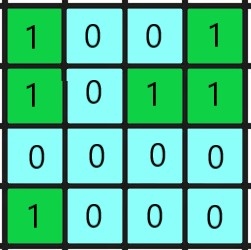

# countIslands

Функція отримує двовимірний масив X \* Y, який складається з одиниць, які означають сушу, і нулів, які означаються воду. Треба порахувати кількість островів.

Острів оточений водою і утворюється поєднанням сусідних земель по горизонталі і по вертикалі.

**Приклад:**



```js
countIslands([
  [1, 0, 0, 1],
  [1, 0, 1, 1],
  [0, 0, 0, 0],
  [1, 0, 0, 0],
]); //3
```

<details>
  <summary>Підказка</summary>

___
 
Спробуйте подумати як застосувати для даної задачі алгоритми пошуку у глубину(DFS) або пошуку в ширину(BFS).

</details>
